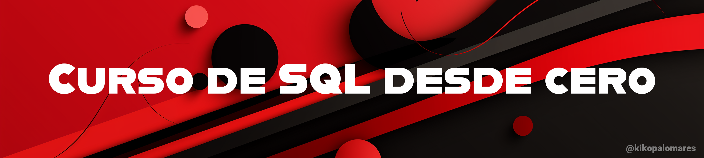

## Herramientas:
- **[Practice SQL](https://chat.openai.com/g/g-Vk0unkZFv-practice-sql)**: GPT que emula un SGBD, de esta forma no tienes que liarte con instalaciones y puedes comenzar lanzando queries directamente.
- **[Vídeo en YouTube](https://youtube.com/kikopalomares)**: en este vídeo acompañamos durante todo este curso explicando cada una de las clases.

## Índice del curso:
### [Clase 1: Introducción a SQL](/clases/clase_1_introduccion_a_SQL/clase.md)
- **Objetivos:** Entender qué es SQL, para qué se utiliza, y cómo funciona en el contexto de las bases de datos relacionales.
- **Temas:**
  - Historia y evolución de SQL.
  - Conceptos básicos de bases de datos relacionales.
  - Diferencias entre SQL y otros lenguajes de programación.
  - Instalación de un sistema de gestión de bases de datos (SGBD) como MySQL, PostgreSQL, o SQLite para prácticas.

### [Clase 2: Creación de tablas](/clases/clase_2_comprendiendo_las_bases_de_datos_y_tablas/clase.md)
- **Objetivos:** Aprender a navegar por una base de datos y entender la estructura de las tablas.
- **Temas:**
  - Uso de comandos básicos: `SHOW DATABASES`, `USE`, `SHOW TABLES`.
  - Entender la estructura de una tabla: `DESCRIBE table_name`.
  - Conceptos clave: tabla, fila, columna, clave primaria.
  - Crear bases de datos y tablas con `CREATE DATABASE` y `CREATE TABLE`.
  - Tipos de datos en SQL.
  - Restricciones y claves foráneas.

### [Clase 3: Consultas básicas (SELECT)](/clases/clase_3_consultas_basicas_select/clase.md)
- **Objetivos:** Realizar consultas simples para recuperar datos de una base de datos.
- **Temas:**
  - Sintaxis básica de `SELECT`.
  - Seleccionar todas las columnas vs. seleccionar columnas específicas.
  - Uso de `WHERE` para filtrar resultados.
  - Operadores lógicos y de comparación.

### Clase 4: Filtrado y ordenamiento de datos
- **Objetivos:** Aprender a filtrar y ordenar los datos de las consultas de manera eficiente.
- **Temas:**
  - Uso avanzado de `WHERE`.
  - Ordenar resultados con `ORDER BY`.
  - Limitar los resultados con `LIMIT`.

### Clase 5: Funciones de agregación y agrupamiento
- **Objetivos:** Entender cómo realizar cálculos sobre grupos de datos.
- **Temas:**
  - Funciones de agregación: `COUNT`, `SUM`, `AVG`, `MAX`, `MIN`.
  - Agrupar datos con `GROUP BY`.
  - Filtrar grupos con `HAVING`.

### Clase 6: Joins
- **Objetivos:** Aprender a combinar filas de dos o más tablas basadas en una columna relacionada entre ellas.
- **Temas:**
  - Tipos de joins: `INNER JOIN`, `LEFT JOIN`, `RIGHT JOIN`, `FULL OUTER JOIN`.
  - Uso de alias para tablas.
  - Resolver conflictos de nombres de columnas.

### Clase 7: Subconsultas y operaciones set
- **Objetivos:** Utilizar subconsultas y entender las operaciones set para combinar múltiples consultas.
- **Temas:**
  - Uso de subconsultas en `SELECT`, `FROM`, y `WHERE`.
  - Operaciones set: `UNION`, `INTERSECT`, `EXCEPT`.

### Clase 8: Manipulación de datos (DML)
- **Objetivos:** Aprender a insertar, actualizar y eliminar datos de las tablas.
- **Temas:**
  - Insertar datos con `INSERT`.
  - Actualizar datos con `UPDATE`.
  - Eliminar datos con `DELETE`.

### Clase 9: Prácticas avanzadas y optimización
- **Objetivos:** Introducir conceptos avanzados y buenas prácticas para optimizar consultas.
- **Temas:**
  - Vistas (`CREATE VIEW`).
  - Índices (`CREATE INDEX`) y su impacto en el rendimiento.
  - Mejores prácticas para escribir consultas eficientes.
